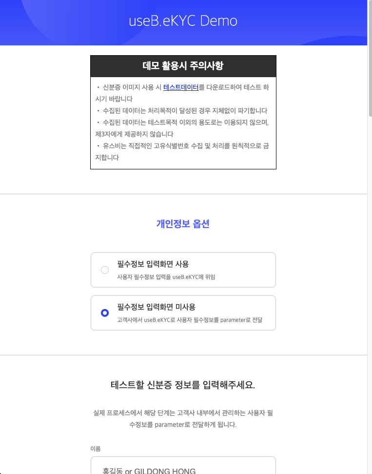

# kyc-iframe-sample 연동 가이드

## 샘플 소스 구성

- 크게 demo와 sample로 나뉘어져 있습니다.
  - demo는 전체 모듈들이 들어있는 폴더 입니다.
  - sample은 신분증인증, 계좌인증등 모듈별로 나뉘어져 있는 폴더 입니다.
    각 폴더는 demo와 같은 구조를 이루고 있으며, 구매하여 사용하는 모듈의 조합과 동일한 샘플을 참고하시면 됩니다. 

```
demo/
├── public/      --> 'npm run build'(gulp build)시 babel로 compile 되지 않고, 배포 산출물 디렉토리 루트에 그대로 복사됩니다.
│   └── img/
│   └── lib/
│   └── res/
├── src/         --> 'npm run build'(gulp build)시 babel로 compile 되어, 배포 산출물 디렉토리에 변환됩니다.
│   └── css/
│       └── demo.css
│       └── style.css
│   └── js/
│       └── event_handler.js
│       └── kyc.js             --> index.html 에서 실행될 샘플 js 입니다.
│       └── ui_handler.js
│       └── util.js
│   └── index.html             --> eKYC 연동시 고객사에서 참고하여 구현할 페이지 예시로 eKYC UI를 띄울 iframe을 포함하고, postMessage를 수신하여 그려주는 ui를 갖습니다.
│
└── gulpfile.babel.js -->  'npm run build'(gulp build)시 실행되는 파일로, gulp를 이용하여 babel로 compile(transpile) 합니다.


sample/
├── module_id_card_ocr                            --> 신분증 인증
│
├── module_id_card_ocr+face                       --> 신분증 인증 + 안면 인증(신분증 얼굴 vs 셀피 비교)
│
├── module_id_card_ocr+face+liveness              --> 신분증 인증 + 안면 인증(신분증 얼굴 vs 셀피 비교 + 라이브니스)
│
├── module_id_card_ocr+face+liveness+account      --> 신분증 인증 + 안면 인증(신분증 얼굴 vs 셀피 비교 + 라이브니스) + 계좌인증
│
├── module_account                                --> 계좌인증
│
├── module_id_card_ocr+account                   --> 신분증 인증 + 계좌인증
│
└── module_id_card_ocr+face+account              --> 신분증 인증 + 안면 인증(신분증 얼굴 vs 셀피 비교) + 계좌인증
```

# 샘플 코드 셋업 가이드

- Step 0) 개발환경 구축 (Node.js, NPM, http-server) 설치

  - https://nodejs.org/ko/download/ 에서 LTS 최신버전 설치
  - 정상적으로 설치되었는지 확인

    

  - http-server 설치 :
    - Linux, MAC :
    ```shell
    sudo npm install -g http-server
    ```
    - Windows :
    ```batch
    npm install -g http-server
    ```
  - gulp-cli 설치 :
    gulp 명령어를 사용하기 위한 cli입니다.
    ```shell
    sudo npm install -g gulp-cli
    ```

---

- Step 1) 샘플 코드 다운로드
  - https://github.com/useb-inc/kyc-sample-iframe/archive/refs/heads/production.zip

---

- Step 2) 압축 풀기 및 데모(또는 샘플) 코드 디렉토리로 이동, 연관 node package 설치
  - 압축 풀기
    - 다운로드한 kyc-sample-iframe-production.zip 파일을 압축 해제
  - 데모 코드 예시
    - 압축해제한 곳에서 ```cd demo``` 명령으로 데모 폴더로 이동
  - 샘플 코드 예시
    - 압축해제한 곳에서 ```cd "sample/module_id_card_ocr+account"```(예시: 신분증+계좌 인증 샘플) 명령으로  폴더로 이동
  - 연관 node package 설치
    - ```npm install``` 명령어로 연관 패키지 설치

---

- Step 3) 실행(https server 실행, 임의로 생성한 샘플 인증서 사용) 및 테스트

  - 인증서 생성
    - ```npm run cert``` 명렁어로 실행 후 'cert.pem' 파일과 'key.pem' 파일이 생성된 것 확인
    - ※ 윈도우 cmd의 경우 'openssl' 명령이 실행되지 않음, ```git bash```를 실행하여 git bash 상에서 명령어 수행)

  - web server 실행
    - ```npm run start``` 명령어로 서버 실행

      

---

- Step 4) 접속 및 테스트(휴대폰 권장, PC의 경우 웹캠 화질이 충분히 좋아야 함)
  - Step 3)에서 나온 서버주소 중 본인의 환경에 맞게 브라우저에서 접속

    

  - 샘플코드에서는 공인된 CA 인증서를 사용하여 HTTPS 서버를 돌리는 것이 아니기 때문에 경고화면 나옴
    - 고급 클릭
    - 아래 화면에서 "서버주소(안전하지 않음)(으)로 이동" 링크 클릭
      
      
  - 아래 화면과 같이 "데모 활용시 주의사항" 화면이 보이면 정상적으로 실행되는 것 입니다.

    

---

- Step 5) DEBUG 윈도우

  - 테스트를 진행하시면서 iframe 내에서 동작하는 KYC 서비스에서 특정 이벤트("KYC 인증 성공" 또는 "실패", "사용자 종료(중도이탈 등)")가 발생되면 postMessage 방식으로 그 결과를 전달합니다.
  - postMessage로 전달된 데이터(json 형식)를 DEBUG 윈도우를 통해 확인할 수 있습니다.

    
    

아래는 postMessage 데이터 인증 결과 Data 처리와 UI 처리 샘플 코드입니다.

```javascript
window.addEventListener("message", (e) => {
  console.log("alcherakyc response", e.data); // base64 encoded된 JSON 메시지이므로 decoded해야 함(needs to be decoded becaused it`s encoded by base64)
  console.log("origin :", e.origin);
  try {
    const decodedData = decodeURIComponent(atob(e.data));
    console.log("decoded", decodedData);
    const json = JSON.parse(decodedData);
    console.log("json", json);

    // 데이터처리 부분
    if (json.result === "success") {
      // TODO: KYC 인증을 성공한 경우 데이터 처리
      // console.log(json.result + "결과 서버 저장");
    } else if (json.result === "failed") {
      // TODO: KYC 인증을 실패한 경우 데이터 처리
      // console.log(json.result + "결과 서버 저장");
    }

    // UI 처리
    else if (json.result === "complete") {
      // TODO: KYC 인증을 성공(자동승인 or 심사필요 케이스 모두 포함) 후 UI 처리
      // iframe이 포함된 UI를 종료
      // 고객사 서비스 UI를 다시 띄우고 상황에 맞는 UI 표시
      // 예시 : 자동승인 -> KYC인증이 완료되었습니다. 계좌개설이 완료되었습니다.
      // 예시 : 심사필요 -> KYC인증이 완료되었습니다. 심사가 완료된 이후 이메일로 안내 드리겠습니다.
    } else if (json.result === "close") {
      // TODO: KYC 인증을 실패(자동거부 or 중도이탈) 후 UI 처리
      // iframe이 포함된 UI를 종료
      // 고객사 서비스 UI를 다시 띄우고 상황에 맞는 UI 표시
      // 예시 : 자동거부 -> KYC인증이 실패하였습니다. 다시 인증을 시도후 서비스 이용이 가능합니다.
    } else {
      // invalid result
    }
  } catch (error) {
    console.log("wrong data", error);
  }
});
```

---
