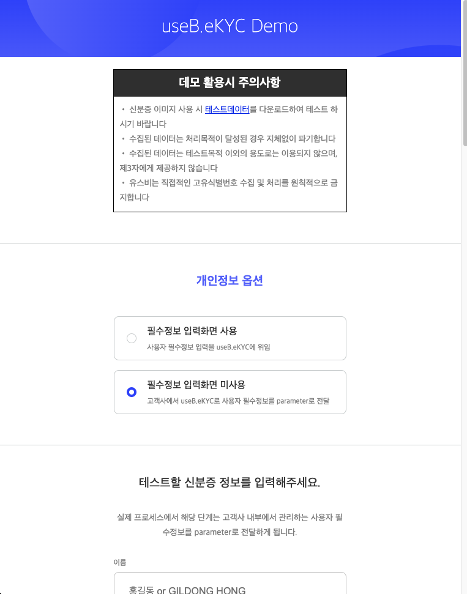

# kyc-iframe-sample

# 주요 샘플 코드 (index.html)

- 샘플코드
  - index.html : https://github.com/useb-inc/kyc-sample-iframe/blob/production/index.html
  - kyc.js : https://github.com/useb-inc/kyc-sample-iframe/blob/production/js/kyc.js

---

# postMessage 데이터 설명 (모듈 전체)

- 포멧

```
{
  "api_response": { 사용불필요
    "result_code": "N100",
    "result_message": "OK."
  },
  "hmac": { 메세지 무결성 인증용
    "timestamp": "2023-06-12T03:30:01Z",
    "vlaue" : "<HMAC_VALUE>"
  }
  "review_result": {
    "id": 210,
    "transaction_id": 심사에 대한 유니크 키 "1686540548390099825-8760076060914995455",
    "request_time": 요청시간 ["2021-12-25T03:55:31.918Z"],
    "name": 이름 ["테스트"],
    "phone_number": 전화번호 ["01012345678]",
    "birthday": 생년월일 ["2000-01-01"],
    "result_type": 종합판정결과 [1 -> 자동승인 | 2 -> 자동거부 | 5 -> 수동심사대상]
    "result_email": 이메일 발송 [0 -> 미발송 | 1 -> 발송완료 | 2 -> 발송실패] (수동심사처리인 경우 심사 완료 후 메일이 발송 됩니다.),
    "result_sms": 메세지 발송 [0 -> 미발송 | 1 -> 발송완료 | 2 -> 발송실패],

    "module": { 고객이 사용하고 있는 기능
      "id_card_ocr": 신분증OCR 기능 사용여부 [true | false],
      "id_card_verification": 신분증진위확인 기능 사용여부 [true | false],
      "face_authentication": 신분증얼굴vs셀피얼굴 비교 기능 사용여부 [true | false],
      "account_verification": 1원 계좌인증 사용여부 [true | false],
      "liveness": 얼굴 라이브니스(진위확인) 기능 사용여부 [true | false],
      "custom_field": [true | false],
      "edd_field": [true | false],
    },
    "id_card": { 신분증인증 결과
      "modified": 신분증 OCR 결과에서 추가 수정여부 [true | false],
      "verified": 신분증 정보 정부기관 진위확인 결과 [true | false],


      "id_card_image": 신분증 민감정보 Masking 사진 ["/9j/4AAQSkZ..."],
      "id_crop_image": 신분증에서 얼굴 crop 사진 ["/9j/4AAQSkZ..."],

      "original_ocr_data": 신분증 OCR 결과(json 형식) ["{\"idType\":\"2\",\"userName\":\"홍길동\",\"driverNo\":[\"12\",\"03\",\"123456\",\"12\"],\"juminNo1\":\"990101\",\"juminNo2\":\"1001234\",\"_juminNo2\":\"1\",\"issueDate\":\"2017-01-01\",\"transaction_id\":\"4dd9c67508fb9e4489ec683dddd3f519\",\"driverNo1\":\"\",\"driverNo2\":\"11-03-123123-11\"}"],
      "modified_ocr_data": 신분증 OCR 결과에서 사용자가 직접 수정한 내용 ["{\"idType\":\"2\",\"userName\":\"임꺽정\",\"driverNo\":[\"12\",\"03\",\"123456\",\"12\"],\"juminNo1\":\"990101\",\"juminNo2\":\"1001234\",\"_juminNo2\":\"1\",\"issueDate\":\"2017-01-01\",\"transaction_id\":\"4dd9c67508fb9e4489ec683dddd3f519\",\"driverNo1\":\"\",\"driverNo2\":\"11-03-123123-11\"}"],

      "id_card_origin": 신분증 원본 촬영 사진 ["/9j/4AAQSkZ..."],
      "is_manual_input": 신분증 사진을 OCR을 사용하지 않고 직접 입력 여부 [true | false],
      "uploaded_type": 신분증 이미지 출처. pc와 mobile은 수동이며 camera일때는 촬영성공 ["pc" | "mobile" | "camera"],
      "is_uploaded": 신분증을 직접 촬영하지 않고 업로드 했는지 여부 [true | false],


    },
    "face_check": { 안면인증 결과
      "is_same_person": 신분증 얼굴사진 vs 셀피 얼굴사진 비교 결과 [true | false],
      "is_live": 셀피 얼굴사진 진위확인(라이브니스) 결과 [true | false]
      "selfie_image": 셀피 얼굴사진 ["/9j/4AAQSkZ..."]
    },
    "account": { 1원 계좌인증 결과
      "verified": 1원 계좌인증 성공여부 [true | false],
      "finance_code": 금융사코드 ["O12"],
      "finance_company": 금융사명 ["OO은행"],
      "account_number": 계좌번호 ["987654321012",],
      "account_holder": 예금주명 ["홍길동"],
      "mod_account_holder": 고객명과 계좌 예금주명이 불일치할 경우 사용자가 수정한 계좌 예금주명["Hong Gil Dong"]
    },
    "custom_result" : [
      {
        "key" : "",
        "value" : "",
        "attachment" : {
          id: 12,
          name: "사업자등록증.png"
        },
        "type" : "file",
      },
      {
        "key" : "",
        "value" : "",
        "attachment" : null,
        "type" : "text",
      }
    ],
    "edd_result" : [
      {
        "key" : "",
        "value" : "[\"직업\",\"근로소득자\",\"급여소득자\"]",
        "type" : "tree" | "ox" | "ox_addr" | "conutry"
      }
    ],
    "ra_result" : {
      "application_id" : 29, // 심사 아이디
      "ra_score" : , // EDD/RA 점수
      "ra_threshold" : [], // EDD/RA 기준값 [30, 70]
      "customer_score" : , // EDD 고객위험 점수 합계
      "customer_std_score" : , // EDD 고객위험 최대 점수
      "svc_score" : , // EDD 상품 및 서비스 위험 점수 합계
      "svc_std_score" : , // EDD 상품 및 서비스 위험 최대 점수
      "country_score" : , // EDD 국가위험 점수 합계
      "country_std_score" : , // EDD 국가위험 최대 점수
      "ra_grade" "low" | "middle" | "high",  EDD/RA 위험 결과
    }
    "histories": { 계좌 변경 정보
      "accounts": [
        {
          "finance_code": "011",
          "account_number": "1234567890987",
          "account_holder": "테스터",
          "created_at": "2022-10-11T06:32:40.063Z"
        }
      ]
    }
  },
  "attachment" : { 첨부파일 - custom_result에서 attachment값이 모두 null값이라면 attachment key는 postmessage에서 보이지 않습니다.
    "1" : {
      "file_name" : "",
      "value" : ""
    }
  }

  "result": 성공 실패 ["success" | "failed"],
}
```

---

- 샘플 (성공케이스 예시)

```json
{
  "api_response": {
    "result_code": "N100",
    "result_message": "OK."
  },
  "hmac": {
        "timestamp": "2023-06-12T03:30:01Z",
        "value": "v6Ky3/EeSr/Jn/omeyUILdt4iBBS5RW9RFAt64F3/Y8="
    },
  "review_result": {
    "id": 210,
    "transaction_id": "",
    "request_time": "2021-12-25T03:55:31.918Z",
    "name": "홍길동",
    "phone_number": "01012345678",
    "birthday": "1990-01-01",
    "result_type": 1,
    "result_email": 0,
    "result_sms": 0,

    "module": {
      "id_card_ocr": true,
      "id_card_verification": true,
      "face_authentication": true,
      "account_verification": false,
      "liveness": false,
      "custom_field": false,
      "edd_field": false,
    },

    "id_card": {
      "modified": true,
      "verified": true,
      "id_card_image": "/9j/4AAQSkZ...",
      "id_crop_image": "/9j/4AAQSkZ...",
      "original_ocr_data": "{\"idType\":\"2\",\"userName\":\"홍길동\",\"driverNo\":[\"12\",\"03\",\"123456\",\"12\"],\"juminNo1\":\"990101\",\"juminNo2\":\"1001234\",\"_juminNo2\":\"1\",\"issueDate\":\"2017-01-01\",\"transaction_id\":\"4dd9c67508fb9e4489ec683dddd3f519\",\"driverNo1\":\"\",\"driverNo2\":\"11-03-123123-11\"}",
      "modified_ocr_data": "",
      "id_card_origin": "/9j/4AAQSkZ...",
      "is_manual_input": false,
      "uploaded_type": "pc",
      "is_uploaded": false,
    },
    "face_check": {
      "is_same_person": true,
      "is_live": null,
      "selfie_image": "data:image/jpeg;base64,/9j/4AAQSkZ..."
    },
    "account": null,
    "custom_result" : null,
    "edd_result" : null,
    "ra_result" : null,
  "result": "success"
}
```

---

- 샘플 (실패 케이스)

```json
{
  "api_response": {
    "result_code": "N100",
    "result_message": "OK."
  },
  "review_result": {
    "id": 210,
    "transaction_id": "1686540548390099825-8760076060914995455",
    "request_time": "2021-12-25T04:18:23.755Z",
    "name": "홍길동",
    "phone_number": "01012345678",
    "birthday": "2021-12-25",
    "result_type": 1,
    "rejected_email": 0,
    "reviewer_sms": 0,
    "module": {
      "id_card_ocr": true,
      "id_card_verification": true,
      "face_authentication": true,
      "account_verification": true,
      "liveness": false,
      "custom_field": true,
      "edd_field": true
    },
    "id_card": {
      "modified": false,
      "verified": false,
      "id_card_image": "/9j/4AAQSkZ...",
      "id_crop_image": "/9j/4AAQSkZ...",
      "originall_ocr_data": "/9j/4AAQSkZ...",
      "modified_ocr_data": "/9j/4AAQSkZ...",
      "id_card_origin": "/9j/4AAQSkZ...",
      "is_manual_input": false,
      "uploaded_type": "pc",
      "is_uploaded": false
    },
    "face_check": null,
    "account": null,
    "custom_result": null,
    "edd_result": null,
    "ra_result": null,
    "histories": {
      "accounts": null
    }
  },
  "result": "failed"
}
```

# 샘플 코드 셋업 가이드

- Step 0) 개발환경 구축 (Node.js, NPM, http-server) 설치

  - https://nodejs.org/ko/download/ 에서 LTS 최신버전 설치
  - 정상적으로 설치되었는지 확인

    

  - http-server 설치 :
    - Linux, MAC :
    ```shell
    sudo npm install -g http-server
    ```
    - Windows :
    ```batch
    npm install -g http-server
    ```
  - gulp-cli 설치 :
    gulp 명령어를 사용하기 위한 cli입니다.
    ```shell
    sudo npm install -g gulp-cli
    ```

---

- Step 1) 샘플 코드 다운로드
  - https://github.com/useb-inc/kyc-sample-iframe/archive/refs/heads/production.zip

---

- Step 2) 압축 풀기

---

- Step 3) 실행(https server 실행, 임의로 생성한 샘플 인증서 사용) 및 테스트

  - 명령어 : npm run cert로 인증서를 받고,(코드입력 후, 아무것도 입력하지 않고 엔터만 쳐줘도 됩니다.)

    cert.pem 파일과 key.pem파일이 만들어진걸 확인한 후, npm run start.

  - 이때 key.pem 파일만 만들어졌을경우, 다시 npm run cert 후, 입력 필드중 한 필드만 값 입력하여 다시 생성.
    

---

- Step 4) 접속 및 테스트(휴대폰 권장, PC의 경우 웹캠 화질이 충분히 좋아야 함)

  

  - Step 3)에서 나온 서버주소 중 본인의 환경에 맞게 브라우저에서 접속
  - 샘플코드에서는 공인된 CA 인증서를 사용하여 HTTPS 서버를 돌리는 것이 아니기 때문에 경고화면 나옴 : 고급 클릭
  - 아래 화면에서 "서버주소(안전하지 않음)(으)로 이동" 링크 클릭
    
    
  - 아래 화면과 같이 "데모 활용시 주의사항" 화면이 보이면 정상적으로 실행되는 것 입니다.

  - 

---

- Step 5) DEBUG 윈도우

  - 테스트를 진행하시면서 iframe 내에서 동작하는 KYC 서비스에서 특정 이벤트("KYC 인증 성공" 또는 "실패", "사용자 종료(중도이탈 등)")가 발생되면 postMessage 방식으로 그 결과를 전달합니다.
  - postMessage로 전달된 데이터(json 형식)를 DEBUG 윈도우를 통해 확인할 수 있습니다.

    
    

아래는 postMessage 데이터 인증 결과 Data 처리와 UI 처리 샘플 코드입니다.

```javascript
window.addEventListener('message', (e) => {
  console.log('alcherakyc response', e.data); // base64 encoded된 JSON 메시지이므로 decoded해야 함(needs to be decoded becaused it`s encoded by base64)
  console.log('origin :', e.origin);
  try {
    const decodedData = decodeURIComponent(atob(e.data));
    console.log('decoded', decodedData);
    const json = JSON.parse(decodedData);
    console.log('json', json);

    // 데이터처리 부분
    if (json.result === 'success') {
      // TODO: KYC 인증을 성공한 경우 데이터 처리
      // console.log(json.result + "결과 서버 저장");
    } else if (json.result === 'failed') {
      // TODO: KYC 인증을 실패한 경우 데이터 처리
      // console.log(json.result + "결과 서버 저장");
    }

    // UI 처리
    else if (json.result === 'complete') {
      // TODO: KYC 인증을 성공(자동승인 or 심사필요 케이스 모두 포함) 후 UI 처리
      // iframe이 포함된 UI를 종료
      // 고객사 서비스 UI를 다시 띄우고 상황에 맞는 UI 표시
      // 예시 : 자동승인 -> KYC인증이 완료되었습니다. 계좌개설이 완료되었습니다.
      // 예시 : 심사필요 -> KYC인증이 완료되었습니다. 심사가 완료된 이후 이메일로 안내 드리겠습니다.
    } else if (json.result === 'close') {
      // TODO: KYC 인증을 실패(자동거부 or 중도이탈) 후 UI 처리
      // iframe이 포함된 UI를 종료
      // 고객사 서비스 UI를 다시 띄우고 상황에 맞는 UI 표시
      // 예시 : 자동거부 -> KYC인증이 실패하였습니다. 다시 인증을 시도후 서비스 이용이 가능합니다.
    } else {
      // invalid result
    }
  } catch (error) {
    console.log('wrong data', error);
  }
});
```

---
